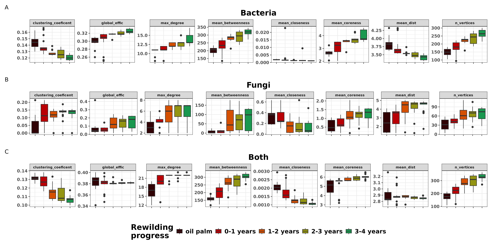

```{r setup, include=FALSE}
knitr::opts_chunk$set(echo = FALSE,warning = FALSE,message = FALSE)
library(tidyverse)
library(kableExtra)
library(phyloseq)

fung <- readRDS("./output/ITS_Physeq_cleaned_w_tree.RDS")
bact <- readRDS("./output/16S_Physeq_cleaned_w_tree.RDS")
```

___

# Experimental design

- Five (5) plots of Malaysian palm oil plantation in various stages of conversion.
    + Active palm oil plot (0)
    + 1 year fallow (1)
    + 1 year fallow + 1 year managed (2)
    + 1 year fallow + 2 years managed (3)
    + 1 year fallow + 3 years managed (4)
- 16 samples from each plot
- For each sample we have **ITS1-5.8S-ITS2** and **full-length 16S**

[Sampling location map](https://www.google.com/maps/d/u/0/viewer?mid=1Jje6npngtSd5nsdgyZiSPmr96sGx1B8&ll=1.6821708070124088%2C103.83712765626184&z=18){target="_blank"}

ITS1-5.8S-ITS2 and full-length 16S sequenced on the new PacBio Revio platform using their Kinnex technique. 

Taxonomy assigned with:

  Bacteria -- [SILVA v 138.1](https://www.arb-silva.de/documentation/release-1381/)
  Eukaryotes -- [Eukaryome v 1.9](https://eukaryome.org/)

<br><br><br>  

___

# Initial results


## Soil chemistry

```{r fig.height=10, fig.width=6}

```

<br><br><br>

___

## Alpha-diversity

In all samples, we have ```r ntaxa(fung)``` fungal and ```r ntaxa(bact)``` bacterial ASVs.

### Fungi (all)
```{r fig.height=8, fig.width=8}

```

### AMF
```{r}
amf <- fung %>% 
  transform_sample_counts(function(x){x/sum(x)}) %>%
  subset_taxa(Phylum == "Glomeromycota")
amf <- 
  amf %>% 
  subset_samples(sample_sums(amf) > 0)
amf %>% 
  plot_bar(fill="Genus") +
  facet_wrap("treatment",scales = 'free_x') +
  labs(y="Relative abundance") +
  scale_fill_viridis_d(option = 'turbo')
```

### Bacteria
```{r fig.height=8, fig.width=8}

```


### Richness by treatment
```{r fig.height=8, fig.width=8}

```


### Richness by soil vars
```{r fig.height=8, fig.width=8}

```

<br><br><br>

___

## Beta-diversity

### Ordinations
```{r fig.height=8, fig.width=8}

```

### Dispersion
```{r fig.height=8, fig.width=8}

```

### GDM (Envir. vs community structure)
```{r fig.height=8, fig.width=8}

```

<br><br><br>

___

## Important taxa (that drive community differences)

Determined using differential abundance testing (corncob) and Random Forest models. These taxa were identified by both methods.

Fungi
```{r fig.height=12, fig.width=18}

```

Bacteria
```{r fig.height=12, fig.width=18}

```


<br><br><br>

___


## Networks

### Network properties
```{r fig.height=12, fig.width=18}

```

### Species richness vs network properties
```{r fig.height=8, fig.width=8}

```


```{r}
x <- 
read_csv("./output/Network_vs_richness_model_table.csv") %>% 
  janitor::clean_names() %>% 
  mutate(across(where(is.numeric),function(x){round(x,4)}))
boldme <- which(x$pr_t < 0.05)
x %>% 
  kable() %>% 
  kable_styling() %>% 
  row_spec(boldme, bold=TRUE) %>% 
  kable_classic(lightable_options = 'hover') %>% 
  scroll_box(height = '500px')
```

### Hub taxa (key network influencers)
```{r}
read_csv("./output/hub_taxa_list.csv") %>% 
  dplyr::select(-vertex_id) %>% 
  kable() %>% 
  kable_styling() %>% 
  kable_classic(lightable_options = 'hover') %>% 
  scroll_box(height = '500px')

```

<br><br><br>

___

## Assembly over time

**These are taxa that ONLY appear after a certain time point**
<br>
```{r fig.height=18,fig.width=12}


```

**Here's probably a better way to show these taxa**

Collaborator Carl Hjelmen put these together. He's a phylogeny guy.

One heatmap showing the number of unique ASVs, the other showing the relative abundance values. I like these, and we will do this for bacteria also of course. But wanted your feedback...

```{r}

```

